# SharedStake Modular Staking V2 — Architecture

> **PR 379 (feat/protocol-v3-fresh)**: StakingRouter, ValidatorModule, LSTWrapModule, and OperatorRegistry are now **UUPS proxies** (ERC-1967). DVTModule has been extracted to `feat/dvt-module` (PR 381) for independent security review. See [`staking-contracts/docs/modular-staking/architecture.md`](../../staking-contracts/docs/modular-staking/architecture.md) for the upgraded architecture details.

## Contract Interaction Diagram

```mermaid
graph TB
    subgraph Users["Users / Node Operators"]
        U[User]
        NO[Node Operator]
    end

    subgraph Governance["Governance Layer"]
        GOV[Governance / Timelock]
        WQ_G[WithdrawalQueue\nGuardian]
    end

    subgraph Oracle["Oracle Layer"]
        OA[OracleAdapter\n─ single-submitter ─]
        QOA[QuorumOracleAdapter\n─ M-of-N consensus ─]
        SUBMITTER[Oracle Submitter]
    end

    subgraph Core["Core Layer"]
        SR[StakingRouter\n─ main entry point ─]
        SC[StakingCore\n─ legacy entry point ─]
        FC[FeeController]
        ST[StToken\n─ rebasing ERC-20 ─]
        WQ[WithdrawalQueueV2]
    end

    subgraph Modules["Staking Modules (PR 379)"]
        VM[ValidatorModule\n─ solo validators ─\n🔷 UUPS Proxy]
        LST[LSTWrapModule\n─ stETH / rETH ─\n🔷 UUPS Proxy]
        DVT["DVTModule\n─ DVT clusters ─\n⏳ deferred to PR 381"]
    end

    subgraph External["External Infrastructure"]
        BDC[Beacon Deposit\nContract 0x000...Fa]
        LST_TOKEN[LST Token\ne.g. stETH]
        PRICE_ORACLE[LST Price Oracle]
    end

    subgraph Registry["Registry / Finance Layer"]
        OR[OperatorRegistry\n─ bond management ─]
        DP[DebtPool\n─ merkle distribution ─]
        RR[ReferralRegistry]
        RCR[ReferralCodeRegistry]
        IPR[InstitutionalPolicyRegistry]
    end

    %% User deposit flows
    U -->|submit ETH| SR
    U -->|submit ETH| SC
    U -->|requestWithdrawals| WQ

    %% Router → modules
    SR -->|receiveDeposit| VM
    SR -.->|receiveDeposit — PR 381| DVT
    SR -->|receiveDeposit| LST

    %% Router → token
    SR -->|mintShares| ST
    SR -->|setTotalPooledEther| ST

    %% StakingCore legacy path
    SC -->|mintShares| ST
    SC -->|setTotalPooledEther| ST

    %% Oracle report chain
    SUBMITTER -->|submitReport| OA
    SUBMITTER -->|submitReport| QOA
    OA -->|reportBeacon| SR
    QOA -->|reportBeacon| SR
    SR -->|computeFees| FC
    FC -.->|fee config| SR
    SR -->|mintShares treasury/operator| ST
    SR -->|depositFeeShares| DP

    %% Withdrawal queue
    WQ -->|burnShares| ST
    WQ_G -->|finalize + ETH| WQ
    U -->|claimWithdrawal| WQ

    %% Validator module → beacon chain
    NO -->|depositToBeaconChain| VM
    NO -->|depositToBeaconChain| DVT
    VM -->|deposit 32 ETH| BDC
    DVT -->|deposit 32 ETH| BDC
    VM -->|notifyBeaconDeposit| SR
    DVT -->|notifyBeaconDeposit| SR

    %% LST wrap module
    U -->|wrapLST amount| LST
    LST -->|getEthValue| PRICE_ORACLE
    LST <-->|transfer| LST_TOKEN

    %% Operator registry
    OR -->|canDeposit check| VM
    OR -.->|canDeposit check — PR 381| DVT
    NO -->|registerOperator / bond| OR

    %% Referral
    SR -.->|recordDeposit| RR
    SR -.->|lookupCode| RCR
    SR -.->|checkPolicy| IPR

    %% DebtPool
    DP -->|merkle claim| U
```



---

## Data Flows

### 1 — User Deposit (Solo Validator Module)

```
User → StakingRouter.submit(referral) {value: ETH}
     → StakingRouter._submitToModule(defaultModuleId, ETH)
       → ValidatorModule.receiveDeposit() {value: ETH}
         → _bufferedEther += ETH
     → StToken.mintShares(user, shares)
     → StToken.setTotalPooledEther(newTotal)
     → emit Deposited(moduleId, user, ETH, shares, referral)
```

### 2 — Oracle Report → Reward Rebase

```
OracleSubmitter → OracleAdapter.submitReport(validators, balance, ts)
               → validateStaleness: now - ts ≤ maxStaleness
               → validateTimestamp:  ts ≤ now - MIN_REPORT_TIMESTAMP_AGE (12s)
               → validateDrift:      Δbalance/validator ≤ maxDriftBps
               → validateSlash:      totalLoss ≤ maxSlashBps
               → StakingRouter.reportModuleBeaconBalance(moduleId, newBalance)
                 → Δrewards = newBalance - lastBalance
                 → FeeController.computeFees(Δrewards)
                   → (treasury, operator, debtPool, referral) amounts
                 → StToken.mintShares(treasury, treasuryShares)
                 → StToken.mintShares(operator, operatorShares)
                 → DebtPool.receiveStETHShares(debtPoolShares)
                 → StToken.setTotalPooledEther(newTotal)   ← triggers rebase
                 → all stToken balances update atomically
```

### 3 — Withdrawal (3-Step)

```
Step 1 — Request:
  User → WithdrawalQueueV2.requestWithdrawals(stTokenAmount)
       → StToken.burnShares(user, stShares)
       → enqueue {owner, stShares, requestedAt, finalized=false}
       → emit WithdrawalRequested(requestId, owner, stShares)

Step 2 — Finalize:
  Guardian → WithdrawalQueueV2.finalize(lastRequestId) {value: ETH}
           → for each pending request [nextFinalize..lastRequestId]:
               ethAmount = stShares × (totalPooled / totalShares)
               request.ethAmount = ethAmount
               request.finalized = true
           → totalPendingRefunds += Σ(guardianRefunds)
           → emit BatchFinalized(from, to, ethProvided)

Step 3 — Claim:
  User → WithdrawalQueueV2.claimWithdrawal(requestId, recipient)
       → assert request.owner == msg.sender
       → assert request.finalized && !request.claimed
       → request.claimed = true
       → send ethAmount to recipient
       → emit WithdrawalClaimed(requestId, owner, ethAmount, recipient)
```

### 4 — Beacon Chain Deposit (Validator Activation)

```
NodeOperator → ValidatorModule.approvePubkey(pubkey)  [GOV approves first]
             → ValidatorModule.depositToBeaconChain(pubkey, withdrawal_creds, sig, root)
               → OperatorRegistry.canDepositValidator(operator) == true
               → delete approvedPubkeys[pkHash]
               → _depositedPubkeys[pkHash] = true
               → _bufferedEther -= 32 ETH
               → BeaconDepositContract.deposit{value: 32 ETH}(...)
               → StakingRouter.notifyBeaconDeposit(moduleId, 32 ETH)
               → emit BeaconChainDeposit(pubkey, 32 ETH, newBuffered)
```

### 5 — Fee Distribution

```
After oracle report:
  StakingRouter._distributeFees(rewards, moduleId)
    try FeeController.computeFees(rewards):
      → (treasury, operator, debtPool, referral) amounts
      → mintShares(treasury, treasuryAmount)
      → mintShares(operator, operatorAmount)
      → debtPool.receiveStETHShares(debtPoolAmount)
      → referralRegistry.depositFeeShares(referralAmount)
    catch:
      → emit FeeDistributionFailed(moduleId, rewards)  ← no revert
```

---

## Trust Boundaries

| Role | Held by | Can do | Cannot do |
|------|---------|--------|-----------|
| **DEFAULT_ADMIN_ROLE** | Governance timelock | Grant/revoke all roles | — |
| **GOV** | Governance timelock | Set fee config, register modules, configure oracle bounds, set mint caps, pause/unpause | Mint tokens directly, finalize withdrawals |
| **MINTER** | StakingRouter (or StakingCore) | Mint and burn stToken shares, set totalPooledEther | Change fee config, register modules |
| **ORACLE** | OracleAdapter / QuorumOracleAdapter | Call `reportBeacon` on StakingCore/StakingRouter | Mint tokens, change config |
| **GUARDIAN** | Designated guardian EOA/multisig | Finalize withdrawal batches, pause modules | Mint tokens, change fee config |
| **SUBMITTER** | Trusted oracle node operators | Submit beacon reports to OracleAdapter | Bypass staleness/drift/slash guards |
| **NODE_OPERATOR** | Validator operators (bonded) | Call `depositToBeaconChain` | Approve pubkeys (GOV only), change module config |
| **FEE_CTRL** | StakingRouter/StakingCore | Deposit fee shares to ReferralRegistry | Change referral fee config |

### Key Invariants

1. Only **one contract** holds MINTER at a time (StakingRouter XOR StakingCore).
2. `totalPendingRefunds ≤ address(WithdrawalQueueV2).balance` — guardian refunds cannot be drained by `recoverEth`.
3. `beaconBalance` changes per oracle report are bounded by `maxDriftBps` and `maxSlashBps`.
4. First oracle report is bounded by `MAX_BEACON_BALANCE_PER_VALIDATOR = 2048 ETH` (C2 fix).
5. Oracle reports with `reportTimestamp ≥ block.timestamp - MIN_REPORT_TIMESTAMP_AGE` (12s) are rejected.
6. DVTModule is deferred to `feat/dvt-module` (PR 381) and is **not part of PR 379**. After PR 381 merges it will be registered via `StakingRouter.registerModule()` with no core contract changes.
7. Last GUARDIAN on WithdrawalQueueV2 cannot be removed (S1 fix).
8. `minRequestAge` for finalization capped at 365 days (S2 fix).

---

## Contract Sizes (Lines of Code)

| Contract | LOC | Role |
|----------|-----|------|
| StakingRouter.sol | ~1015 | Central dispatcher |
| StakingCore.sol | ~540 | Legacy entry point |
| OperatorRegistry.sol | ~451 | Operator bond management |
| WithdrawalQueueV2.sol | ~340 | Exit queue |
| DebtPool.sol | ~324 | Merkle fee distribution |
| DVTModule.sol | ~329 | DVT cluster validator — *deferred to PR 381* |
| ValidatorModule.sol | ~314 | Solo validator |
| QuorumOracleAdapter.sol | ~236 | M-of-N consensus oracle |
| ReferralRegistry.sol | ~238 | Referral rewards |
| StToken.sol | ~193 | Rebasing ERC-20 |
| LSTWrapModule.sol | ~225 | LST wrap/unwrap |
| OracleAdapter.sol | ~175 | Single-submitter oracle |
| FeeController.sol | ~165 | Fee config |
| OldVeth2WithdrawalQueue.sol | — | Legacy V2 withdrawal queue |
| **Total** | **~4,805** | |

---

*Generated 2026-06-12. Branch: feat/protocol-v3-fresh.*
