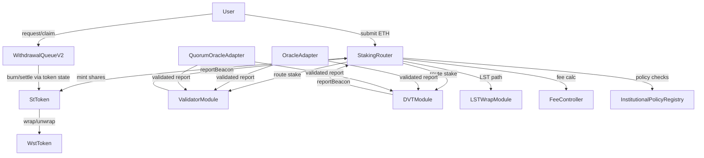
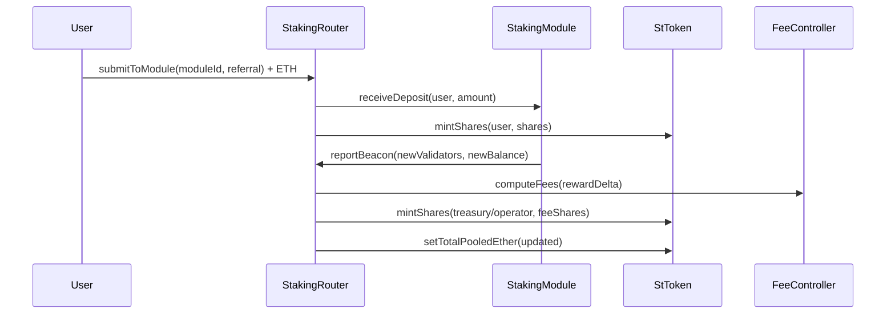
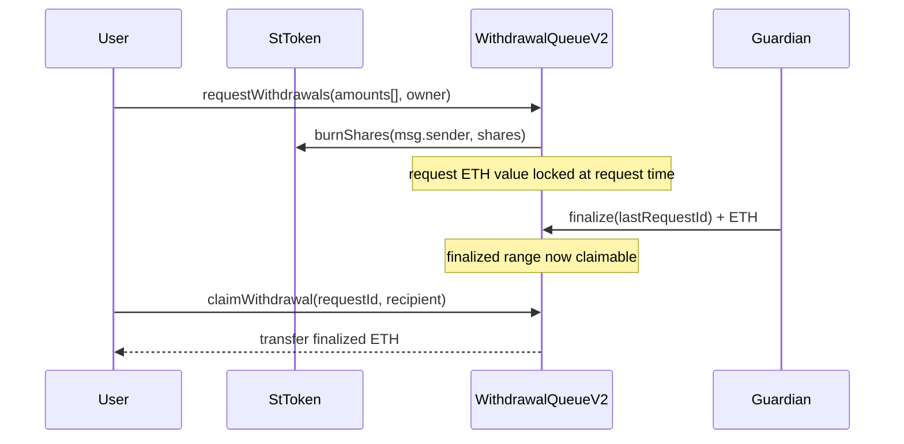
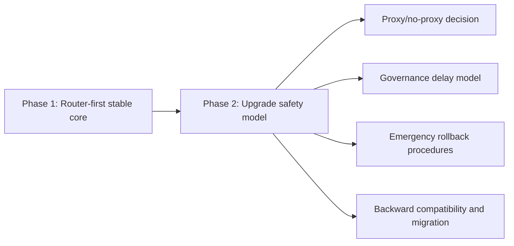

# SharedStake V2 Modular Staking Diagrams (Router-First)

These diagrams represent the chosen architecture for this phase: router-first, single optimal path.

## 1. Router-First Component Map



## 2. Deposit and Rebase (Router Path)



## 3. Queue Lifecycle



## 4. Oracle Validation Flow

```mermaid
flowchart TD
    A[submitReport()] --> B{report timestamp fresh?}
    B -- no --> X[revert stale report]
    B -- yes --> C{drift/slash bounds valid?}
    C -- no --> Y[revert sanity failure]
    C -- yes --> D{quorum/submitter criteria met?}
    D -- no --> E[store vote or await quorum]
    D -- yes --> F[forward to reportable module]
    F --> G[module updates router state]
    G --> H[router fee + pooled update]
```

## 5. Future Upgradeability Boundary (Deferred)


